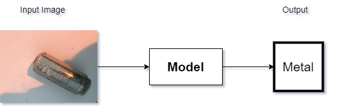

<h1 align="center">Garbage Classification Using Deep Learning
Techniques</h1>

# Abstract
Garbage management is a major and unsolved
issue across the country. Many countries have unique garbage
management policies. There is no established method to manage
the garbage appropriately. Proper waste recycling can give good
profit to the government. That’s why we propose an automation
technique to detect and categorize waste properly. Garbage
classification is an important stage in enabling cost-effective
recycling among the tasks required for recycling. In this research,
we try to recognize single waste objects in photographs and
classify them into recycling categories.

# Index Terms

Garbage Classification, Recycling, Deep Learning, Convolutional Neural Networks, ResNet, MobileNetV2,
DenseNet

# Introduction

Since the introduction of deep learning, image classification has become more efficient and accurate than ever. It
has boosted the development of computer vision and helped
people in various fields. Garbage classification can be done by
image classification. In this work, we investigate modern deep
learning or image classification techniques to classify garbage
from an image.
Garbage is a by-product of urbanization. People’s consumption levels have improved due to economic development, and
residential waste has significantly increased. Currently, the
world produces 2.01 billion tons of municipal solid trash
every year, causing environmental damage. If the present
situation continues, waste generation will rise by 70% in 2050. Recycling is gradually becoming an integral ingredient
of a sustainable society. The acquisition, classification, and
processing of recycled materials impose a substantial hidden
cost on the entire recycling process. In garbage recycling,
garbage classification is quite vital. If not correctly classified, it
will not only squander reusable resources but may also pollute
the environment and harm people’s health. However, many
residents are unaware of waste categorization or lack classification knowledge. Finding an automated approach to recycling
is extremely valuable in an industrial and information-based
world, as it has environmental and economic benefits.
Deep learning has gain traction in recent years, and its
rapid improvement has greatly aided human convenience.
Computer vision technology has had a significant impact on
people’s lives and has already established itself as an essential component of human life. Many researchers are currently
conducting experiments using these innovations to apply to garbage classification tasks.
In this work, we implement some of the image classifications techniques to categorize garbage

# Architecture and Flow Chart

## Project Main Goal

## Flow of The Project Output
|Flowchart of Tasks    | Image Filter Applied      |
|:----------:|:-------------:|
|  |   |

## Flow of The Model
|Simple CNN  | ResNet50    |DenseNet121    | MobileNetV2    |
|:----------:|:-------------:|:-------------:|:-------------:|
|      |   |  |  |

# Contributing
<table>
  <tr>
    <td align="center">
        <a href="https://github.com/Rafat97">
            
             <b>Emdadul Haque</b>
             <b>Rafat97</b>
        </a>
    </td>
    <td align="center">
        <a href="https://github.com/farazkabir">
            
             <b>Faraz kabir</b>
             <b>farazkabir</b>
        </a>
    </td>
    <td align="center">
        <a href="https://github.com/Rezwan1581">
            
             <b>Rezwan Ahmed</b>
             <b>Rezwan1581</b>
        </a>
    </td>
    <td align="center">
        <a href="https://github.com/Swaad">
            
             <b>Swaad</b>
             <b>swaad</b>
        </a>
    </td>

  </tr>
</table>

<h1 align="center">--- Thank You ---</h1>